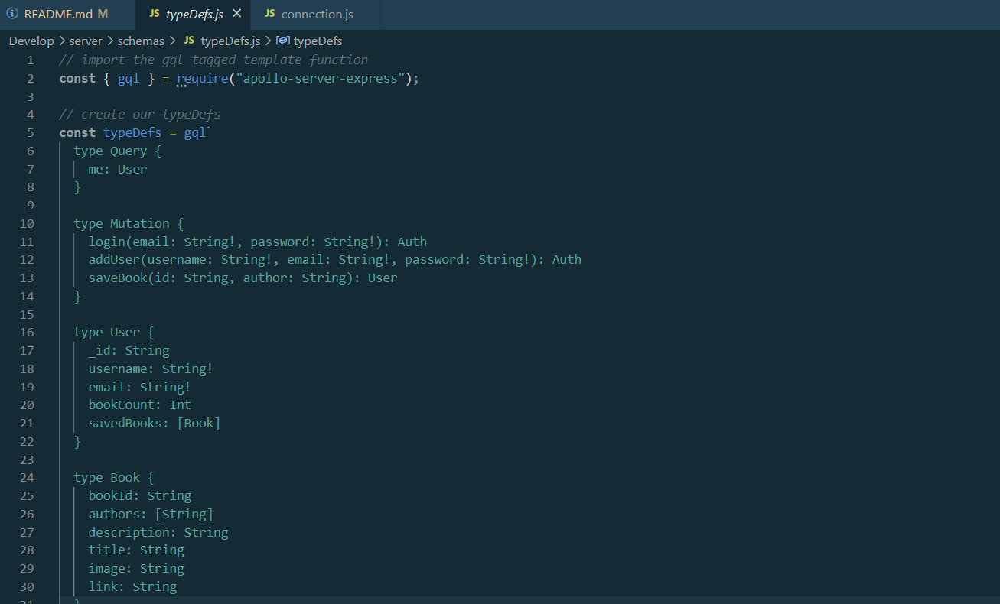

# booking-around

## Description

This repository contains the Google Books API, refactored to be a GraphQL API. Users are able to search for books, create an account, log in, and add/remove books to their account.

### Technologies

- MongoDB
- GraphQL (via Apollo)
- React

## Instructions

1. Download or clone the code.
2. run `npm i`
3. run `npm install apollo-server-express@2.15.0`
4. run `mongod` to make sure MongoDB is installed.

## Screenshot

## Links

Deployed at: https://git.heroku.com/booking-around.git
